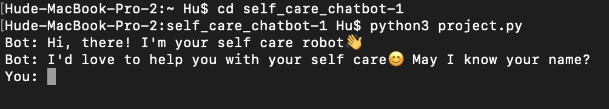

# Self care chatbot

#### Video Demo: <https://youtu.be/kfDNm_bembs>

#### Usage:

Download the repository and open it up in your terminal. If you already have Python installed in your computer, cd into the folder and then type "python3 project.py" to run the project. If not, download Python via visiting <https://www.python.org/downloads/>

#### Description:

This is a chatting robot which runs in user's command line.

It stores a variety of self care ideas, which are categorized in 8 different moods, in a file called data.py. Those moods are: happy, overwhelmed, stressed, anxious, sad, angry, tired, depressed, and excited. In data.py, it also stores there's also a list of IMDB Top 250 movies <URLhttps://www.imdb.com/chart/top/?ref_=nv_mv_250>(read and append from WATCHLIST.csv).

In project.py, first it asks the user about her/his name, then it prompts the user to enter the mood she/he is in (must be one of the eight moods), and provides user with a self care idea based on user's mood randomly, after that asks the user whether she/he is satisfied with the idea provided or not. If not, it will provide one more self care idea to user.

Following the self care idea suggestion, chatbot asks the user if she/he wants a movie recommendation, and then recommends a movie randomly from the movie list, and then reaches the end of the project. If not, then the project ends without any movie recommendation.
